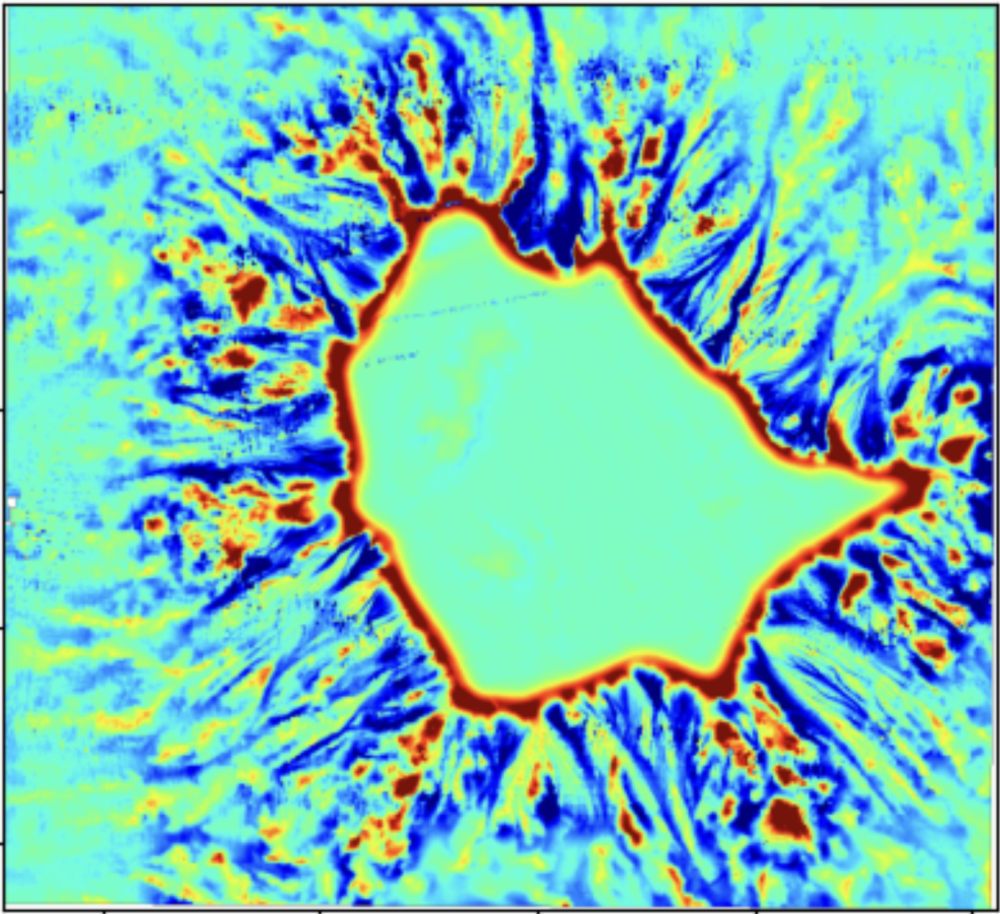

# Geomorphology Cookbook



[](https://github.com/ProjectPythia/cookbook-template/actions/workflows/nightly-build.yaml)
[](https://binder.projectpythia.org/v2/gh/ProjectPythia/cookbook-template/main?labpath=notebooks)
[](https://zenodo.org/badge/latestdoi/475509405)

This Project Pythia Cookbook introduces open-source Python workflows for seabed geomorphology using bathymetry rasters. It is inspired by Geoscience Australia’s Semi-automated Morphological Mapping Tools for Seabed Characterisation (GA-SaMMT), which provide rule-based tools for mapping, characterising, and classifying seabed morphology from bathymetry.

## Motivation

- What: A cookbook adapting ArcGIS PRO workflow in Geoscience Australia’s Semi-automated Morphological Mapping Tools (GA-SaMMT) for open science.
- Why: Seafloor morphology maps support marine geoscience, habitat mapping, and environmental management. However, many workflows remain manual or difficult to reproduce (e.g., ArcGIS Pro tools)
- How: Starting from GeoTIFF bathymetry, the cookbook will compute terrain metrics, delineate candidate features, and produce GIS-compatible labeled polygons for landforms (e.g., valleys, ridges, depressions, and plateaus) with notebook visualization
- Who: This project is for anyone interested in geomorphology, bathymetry, GIS, and Python geospatial in general.


## Data

The cookbook uses three bathymetry GeoTIFF datasets:

* **Gifford Canyon**
* **Oceanic Shoals**
* **Point Cloates**

These datasets are used to demonstrate how methods behave across different seabed settings and spatial patterns.

Each raster is explored for coordinate reference system, bounds, resolution, nodata value, dimensions, value range, and bathymetry sign convention before any terrain analysis is applied.

Huang, Z., Nanson, R., Nichol, S., Sixsmith, J., 2022 Geoscience Australia's Semi-automated Morphological Mapping Tools (GA-SaMMT) for Seabed Characterisation. Commonwealth of Australia (Geoscience Australia). https://dx.doi.org/10.26186/146832

The associated ArcGIS Pro tools and dataset samples are available at [https://ecat.ga.gov.au/geonetwork/srv/eng/catalog.search#/metadata/146832](https://ecat.ga.gov.au/geonetwork/srv/eng/catalog.search#/metadata/146832).  

## Structure (in progress...)

This cookbook is organized as a sequence of notebooks that move from data context to morphology workflows.

### 1. Data story and metadata

These notebooks introduce the scientific context and prepare the bathymetry rasters for analysis.

* `DataStory.ipynb` — introduces the seabed morphology problem, the GA-SaMMT workflow, and the role of open science.
* `Metadata.ipynb` — inspects CRS, bounds, resolution, nodata values, raster dimensions, and bathymetry ranges.
* `rasterviz-intro.ipynb` — demonstrates geospatially correct raster visualization, colorbars, map coordinates, and hillshade-style displays.

### 2. Raster morphology methods

These notebooks introduce the raster derivatives used to identify bathymetric highs and lows.

* `TPI.ipynb` — computes Topographic Position Index and applies GA-SaMMT-style thresholding.
* `Openness_Closeness.ipynb` — explains positive and negative openness and their relationship to enclosed or dominant terrain.
* `LMI.ipynb` (in progress) — introduces Local Moran’s I as a spatial autocorrelation method for clustered bathymetric high features.
* `CI.ipynb` (in progress) — introduces Convergence Index for identifying convergent bathymetric low features.

### 3. Polygon export and morphometrics

These notebooks move from raster masks to vector features and attributes.

* `Polygon_Export.ipynb` — converts candidate feature masks to polygons and exports GIS-compatible files.
* `Morphometrics.ipynb` (in progress) — computes core shape and topographic attributes for candidate morphology features.

## Authors
Kathryn Rooney, Nelofar Qulizada, James Munroe, Orhan Eroglu, and Thomas Guilment.

### Contributors
<a href="https://github.com/ProjectPythia/geomorphology-cookbook/graphs/contributors">
  
</a>

## Reference
Huang, Z., Nanson, R., Nichol, S., Sixsmith, J., 2022 Geoscience Australia's Semi-automated Morphological Mapping Tools (GA-SaMMT) for Seabed Characterisation. Commonwealth of Australia (Geoscience Australia). https://dx.doi.org/10.26186/146832


## Running the Notebooks

You can either run the notebooks in the Cookbook using [Binder](https://binder.projectpythia.org/) or on your local machine.

### Running on Binder

The simplest way to interact with a Jupyter Notebook is through
[Binder](https://binder.projectpythia.org/), which enables "one click"
execution in the cloud. Simply navigate your mouse to
the top right corner of the book chapter you are viewing and click
on the rocket ship icon (see screenshots [here](https://foundations.projectpythia.org/preamble/how-to-use/#running-pythia-foundations-examples)),
and a text box will appear. Type or paste the Pythia Binder link
(`https://binder.projectpythia.org`) and click "Launch".
After a few moments, you should be presented with a
notebook that you can interact with. You’ll be able to execute code
and even change the example programs. At first, the code cells
have no output, until you execute them by pressing
{kbd}`Shift`\+{kbd}`Enter`. Complete details on how to interact with
a live Jupyter notebook are described in the Pythia Foundations chapter [Getting Started with
Jupyter](https://foundations.projectpythia.org/foundations/getting-started-jupyter).

Note, not all Cookbook chapters are executable. If you do not see
the rocket ship icon, such as on this page, you are not viewing an
executable book chapter.


### Running on Your Own Machine

If you are interested in running this material locally on your computer, you will need to follow this workflow:

(Replace "cookbook-example" with the title of your cookbooks)

1. Clone the `https://github.com/ProjectPythia/geomorphology-cookbook` repository:

   ```bash
    git clone https://github.com/ProjectPythia/geomorphology-cookbook.git 
    ```

1. Move into the `cookbook-example` directory
   ```bash
   cd cookbook-example
   ```
1. Create and activate your conda environment from the `environment.yml` file
   ```bash
   conda env create -f environment.yml
   conda activate cookbook-example
   ```
1. Move into the `notebooks` directory and start up Jupyterlab
   ```bash
   cd notebooks/
   jupyter lab
   ```
